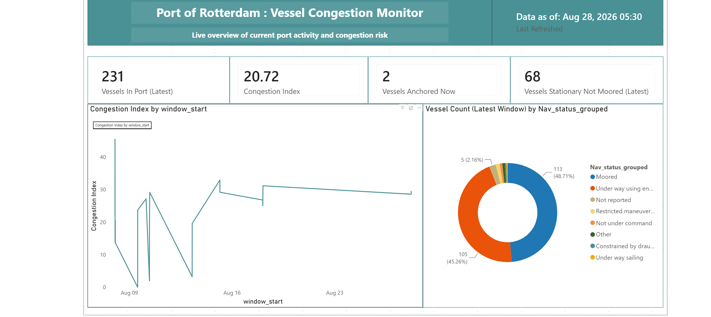
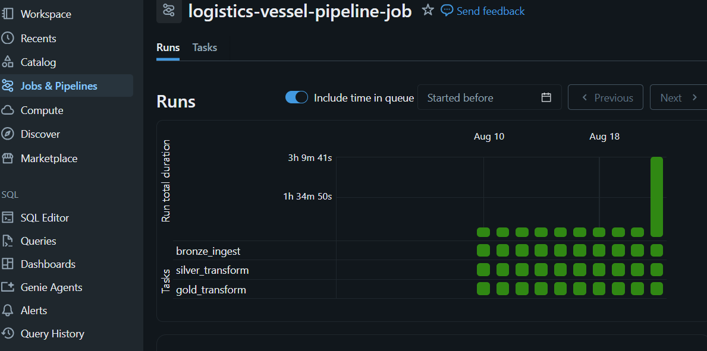

# Port of Rotterdam Vessel Congestion Pipeline

This is fully automated, end to end data pipeline that turns live AIS vessel tracking data into a real time port congestion signal that is built on Databricks, orchestrated with scheduled Jobs, validated with Azure DevOps CI/CD and visualized in Power BI.

**Live pipeline runs every 30 minutes, with zero manual intervention.**

---

## The Business Problem

Poor real time visibility is one of the most cited pain points in logistics, companies often can't tell, at a glance, whether a port is experiencing unusual congestion right now or whether it's just normal traffic. Major ports (including Antwerp-Bruges) have seen real disruptions from congestion in recent years and the underlying signal,  vessels waiting or stuck is often only visible after the fact.

This project answers a specific, narrower question a port operations planner would actually ask:

> **"Right now, is this port more congested than usual and is that because vessels are genuinely stuck or just normal anchoring/mooring activity?"**

**Scope:** This is a monitoring tool, not a predictive one. It reports current/recent state derived from live AIS behavior, not a forecast and it is not connected to port authorities' actual operational data (berth schedules, terminal capacity). It infers likely congestion from vessel movement patterns, a legitimate, defensible engineering approach, but a proxy, not a ground truth measurement.

---


## Dashboard



*Live congestion metrics, refreshed via DirectQuery , reflects current Gold table state on every view.*

## Automation in Action



*Scheduled Databricks Job (`bronze_ingest → silver_transform → gold_transform`), running automatically every 30 minutes with task dependencies enforced.*


## Architecture

```
VesselAPI (REST, live AIS data)
        ↓
  Bronze  :raw JSON, Unity Catalog Volume, automated ingestion every 30 min
        ↓
  Silver  :cleaned, deduplicated, typed, quarantined (Auto Loader, incremental)
        ↓
  Gold    :aggregated congestion metrics (5-min snapshot windows)
        ↓
  Power BI :live dashboard (DirectQuery)
```

All three stages run as a single Databricks Job with explicit task dependencies (`bronze_ingest → silver_transform → gold_transform`), on a 30-minute schedule, with email failure notifications.

### Tech stack

| Layer | Tool |
|---|---|
| Data source | [VesselAPI](https://vesselapi.com) :REST, AIS vessel tracking |
| Compute & storage | Databricks (Unity Catalog, Volumes, Auto Loader, Delta Lake) |
| Orchestration | Databricks Jobs (scheduled, task dependencies, failure alerts) |
| Secrets | Databricks Secrets (not `.env` in the cloud version) |
| CI | Azure DevOps Pipelines (syntax check + lint on every push) |
| Visualization | Power BI (DirectQuery, live connection) |
| Version control | GitHub, synced via Databricks Repos |

---

## Key Engineering Decisions (and how they were validated)

This project is built on a principle: **don't trust a number just because the code ran without errors.** A few concrete examples of that in practice.

### 1. The congestion metric was wrong on the first attempt

The core signal (`stationary_not_moored_pct`) flags vessels reporting near zero speed while their AIS status implies they should be moving. The first version flagged an implausibly consistent ~20% of vessels in *every* time window, suspicious on its face, since real congestion should vary more than that.

Investigating the actual `nav_status` breakdown showed the definition was incorrectly counting **"At anchor"** and **"Not reported"** vessels as congestion, both legitimate/non problematic states. The definition was refined to exclude them, bringing the signal down to a more defensible, stable ~15%. This is documented directly in the `02_silver_to_gold` notebook, next to the metric it affects.

### 2. A duplicate data bug root cause

Early Bronze ingestion runs produced 3,000+ records per poll, almost entirely duplicates. Rather than just increasing pagination limits to accommodate the volume, the root cause was identified: VesselAPI's default 2 hour look back window was causing the same broadcast to be re served repeatedly. Narrowing the query window to match the poll interval fixed the actual cause, cutting one run from 3,000 duplicate heavy records to under 200.

### 3. A full null handling audit

Every column's null rate was measured against real data (not guessed), and a documented decision made for each:
- `imo` — 59% null. **Expected**: only larger seagoing vessels are assigned an IMO number under international convention; most tracked traffic is smaller/local craft.
- `heading` / `nav_status` — 57% null (identical count likely the same underlying AIS message type). **Known limitation**: the congestion metric is effectively built from the ~43% of vessels that report status, not the full tracked fleet.
- `cog` :36% null. **Expected**: course over ground is only meaningful for a moving vessel.

### 4. Incremental processing verification with a real test
After migrating Silver to Databricks Auto Loader (incremental, not full batch reprocessing), the behavior was explicitly tested: ingestion was run a second time and Silver's row count was confirmed to grow by *exactly* the new batch's contribution (1,205 → 1,264 rows) proving only new files were processed, not the entire history reprocessed.

### 5. Provider reliability drove a real architectural pivot

The original ingestion design used a WebSocket-based provider (AISstream.io). Recurring TLS certificate expirations and extended outages made it unreliable for a scheduled, automated pipeline. Rather than losing more time to a flaky beta service, the design was deliberately switched to a REST based provider (VesselAPI) with a scoped time window,  a more resilient architecture for this use case, at the cost of true real time streaming.

---

## Known Limitations

- **Congestion signal coverage**: ~43% of tracked vessels report `nav_status`; the metric is built on that subset, not the full fleet.
- **Not predictive**: reports current/recent state, not a forecast.
- **No ground-truth operational data**: congestion is inferred from AIS movement patterns, not connected to actual berth/terminal schedules.
- **No zone level breakdown**: the entire Rotterdam bounding box is treated as one area; sub zone congestion (e.g. specific terminals) isn't captured.
- **Data history has gaps**: reflects development period testing (manual runs, Job debugging), not continuous production uptime. Once the scheduled Job runs continuously, history will be uninterrupted.
- **Gold uses `overwrite`, not incrementally**: correct and deliberate, Gold represents a fully recomputed current snapshot, not an accumulating log (unlike Silver, which uses `append`).
- **CI, not full CD**: Azure DevOps runs syntax/lint checks on every push. Automated deployment to Databricks is not yet implemented.

---

## Repository Structure

```
logistics-vessel-pipeline/
├── ingestion/
│   └── vessel_bronze_ingest.py       # Local/dev version of Bronze ingestion
├── notebooks/                         # (Databricks notebooks, synced via Repos)
│   ├── 00_bronze_ingest                # Automated version : Databricks Secrets, Volume writes
│   ├── 01_bronze_to_silver             # Incremental (Auto Loader), dedup, null audit
│   └── 02_silver_to_gold               # Congestion metrics, empirically validated
├── azure-pipelines.yml                # CI: syntax check + lint on push to main
├── requirements.txt
├── .gitignore
└── README.md
```

---

## Setup

1. Clone the repo
2. Create a `.env` file (local dev only) with `VESSELAPI_KEY=your_key_here`
3. `pip install -r requirements.txt`
4. Run `ingestion/vessel_bronze_ingest.py` for local testing, or use the Databricks notebooks for the full automated pipeline (requires a Databricks workspace with Unity Catalog, and a `VESSELAPI_KEY` secret in a scope named `vessel-pipeline-secrets`)

---

## Author

Built by [Emmanuel Uzokwe](https://github.com/Emmachi4life) as a portfolio project demonstrating end to end data engineering on Databricks :ingestion, incremental transformation, orchestration, CI/CD, and BI delivery.
